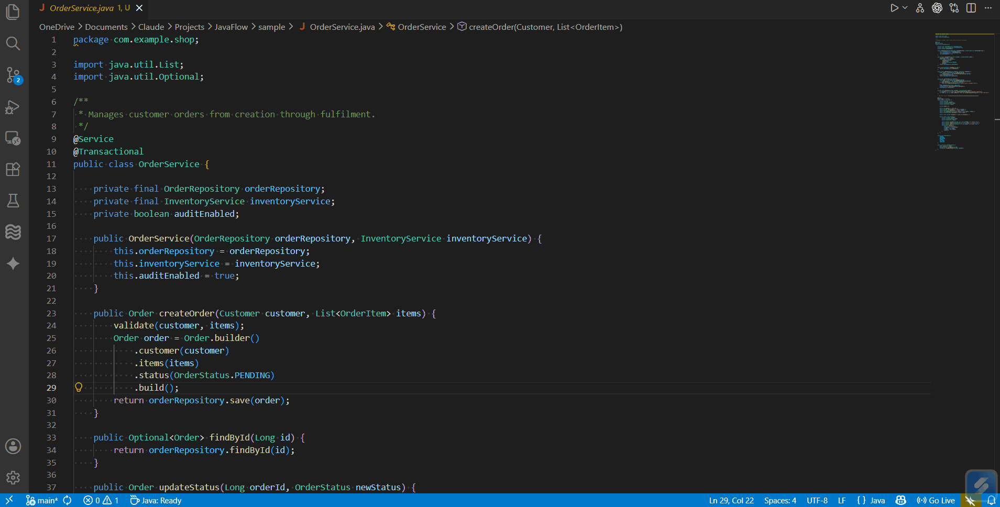

# JavaFlow



JavaFlow is a Visual Studio Code extension that helps developers understand Java codebases through interactive mind maps. It scans Java files, extracts classes, fields, methods, imports, inheritance details, and simple method call references, then renders the result as a Markmap-powered visualization inside VS Code.

The extension is designed for quick code exploration, onboarding, and high-level understanding of Java projects.

## Features

- Generate a mind map for a single Java file or an entire folder.
- Extract classes, interfaces, enums, fields, and methods with visibility modifiers.
- Extract **constructors** as first-class members alongside methods.
- Extract **class-level annotations** generically — any `@AnnotationName`, including parameterised forms such as `@Table(name="users")`.
- Extract **enum constants** in declaration order.
- Detect **nested and static nested classes** (including builder pattern classes) with correct parent–child links.
- Parse **generic class declarations** such as `Container<T>` and `Repository<T, ID>`.
- Show inheritance (`extends`) and implemented interface details.
- Generate plain-English summaries from Javadoc or naming patterns (NLP).
- Search with **prev/next navigation**, node highlighting, and automatic ancestor unfolding. Supports Enter / Shift+Enter keyboard shortcuts.
- Expand all, collapse all, fit to screen, and export the mind map as SVG.
- Open **multiple mindmap panels simultaneously** — compare two classes or packages side by side.
- All Markmap and D3 assets are **bundled locally** — works fully offline, no CDN required.
- Configure whether private members and NLP summaries are shown.

## Folder Structure

```text
javaflow/
|-- src/
|   |-- extension.ts
|   |-- parser/
|   |   `-- javaParser.ts
|   |-- nlp/
|   |   `-- summarizer.ts
|   |-- mindmap/
|   |   `-- mindmapGenerator.ts
|   |-- analysis/
|   |   `-- workspaceIndex.ts
|   `-- webview/
|       `-- mindmapPanel.ts
|-- media/
|   |-- d3.min.js
|   |-- markmap-lib.js
|   |-- markmap-view.js
|   `-- demo.gif
|-- scripts/
|   `-- bundle-media.js
|-- package.json
|-- tsconfig.json
`-- .vscodeignore
```

### `src/extension.ts`

This is the main entry point of the VS Code extension. It registers the extension commands, reads selected Java files or folders, collects Java source files, calls the parser, generates the mind map content, and opens the webview panel.

Main responsibilities:

- Register `javaflow.showMindmap`.
- Register `javaflow.showMindmapForFolder`.
- Read extension configuration.
- Collect Java files from folders.
- Display progress and error messages.

### `src/parser/javaParser.ts`

This file contains the Java parsing logic. It uses [java-parser](https://www.npmjs.com/package/java-parser) — a full CST (Concrete Syntax Tree) parser based on chevrotain — to accurately extract information from Java source code. This replaces an earlier regex-based approach and handles all standard Java syntax correctly.

It extracts:

- Package name and imports
- Classes, interfaces, enums (including generic declarations such as `Container<T>`)
- Class-level annotations including parameterised forms (`@Table(name="users")`)
- Enum constants in declaration order
- Constructors, fields, and methods with visibility modifiers
- Nested and static nested classes with correct parent–child links
- Inheritance (`extends`) and implemented interfaces
- Javadoc comments

### `src/nlp/summarizer.ts`

This module generates readable summaries for parsed Java code. It first uses Javadoc if available. If Javadoc is missing, it creates simple template-based summaries from class names, method names, field names, parameters, and return types.

Examples:

- `getUserName()` becomes a summary like "Returns the user name."
- `UserService` becomes a summary like "Service layer handling user business logic."
- `saveOrder()` becomes a summary like "Persists order."

### `src/mindmap/mindmapGenerator.ts`

This module converts parsed Java class data into Markdown formatted for Markmap. The generated Markdown is structured as a tree, with sections for package details, summaries, hierarchy, fields, methods, calls, and dependencies.

It supports:

- Single-class mind maps
- Folder-level mind maps
- Optional private member filtering
- Optional summaries
- Call reference display limits

### `src/webview/mindmapPanel.ts`

This file creates and manages the VS Code webview used to display the interactive mind map. It loads Markmap and D3 in the webview, renders the generated Markdown as an SVG mind map, and provides toolbar actions.

Toolbar actions include:

- **Expand all** / **Collapse all** — walks the live node tree and calls `renderData()` directly
- **Fit to screen**
- **Search** — finds matching nodes, shows `X / Y` count, navigates with Prev/Next buttons or Enter/Shift+Enter, highlights the match, unfolds ancestors, and pans the viewport to it
- **Export as SVG**

Multiple panels can be open at the same time. Each unique file or folder path gets its own panel; re-invoking on the same source reveals and refreshes the existing panel.

## Requirements

- Node.js
- npm
- Visual Studio Code 1.85.0 or newer

## Installation for Development

Clone the repository:

```bash
git clone https://github.com/Murali11134/javaflow.git
cd javaflow
```

Install dependencies:

```bash
npm install
```

Compile the extension:

```bash
npm run compile
```

Open the project in VS Code:

```bash
code .
```

Press `F5` in VS Code to launch an Extension Development Host.

## Usage

### Generate a Mind Map for One Java File

1. Open a `.java` file in VS Code.
2. Right-click inside the editor or use the editor title action.
3. Select `JavaFlow: Show Mindmap`.
4. JavaFlow opens an interactive mind map beside the editor.

### Generate a Mind Map for a Folder

1. Right-click a folder in the VS Code Explorer.
2. Select `JavaFlow: Show Mindmap for Folder`.
3. JavaFlow scans Java files in that folder and creates a package-level mind map.

## Extension Commands

| Command | Description |
| --- | --- |
| `javaflow.showMindmap` | Generates a mind map for the selected or active Java file. |
| `javaflow.showMindmapForFolder` | Generates a mind map for Java files inside a selected folder. |

## Configuration

JavaFlow contributes the following VS Code settings:

| Setting | Default | Description |
| --- | ---: | --- |
| `javaflow.maxDepth` | `3` | Maximum depth of call graph traversal shown in the mind map. |
| `javaflow.showPrivateMembers` | `false` | Include private fields and methods in the mind map. |
| `javaflow.nlpSummaries` | `true` | Generate plain-English summaries for classes and methods. |

## Pros

- Clean and simple project structure.
- Easy to understand and extend.
- Useful for visualizing Java code quickly.
- Supports both file-level and folder-level views.
- Does not require an external AI API.
- Generates summaries locally from Javadoc and naming patterns.
- Provides an interactive UI with search, expand, collapse, fit, and export actions.
- Compiles successfully with TypeScript.

## Current Limitations

- Records, sealed classes, and text blocks are parsed structurally but not yet surfaced in the mindmap output.
- The folder scan is capped at 200 Java files.
- The test suite covers core parser and mindmap generation behaviour; broader edge-case coverage is still needed.
- Template-based NLP summaries are helpful but are not true semantic code understanding.

## Development Scripts

```bash
npm run compile
```

Compiles the TypeScript source into the `out/` directory.

```bash
npm run watch
```

Runs TypeScript in watch mode during development.

```bash
npm test
```

Compiles the extension and runs the basic test suite from `src/test/runTest.ts`.

## Suggested Improvements

- Surface records and sealed classes in the mindmap output.
- Expand unit tests for parser behaviour, summary generation, and mindmap generation.
- Improve folder scanning for large Java projects (beyond the 200-file cap).
- Publish to the VS Code Marketplace and add an extension badge to this README.

## Project Status

JavaFlow is a functional VS Code extension with a solid CST-based Java parser, interactive mindmap rendering, multi-panel support, and working search navigation. It is ready for daily use on standard Java projects. The main gaps before a full marketplace release are call-graph extraction, records/sealed class output, and broader test coverage.
